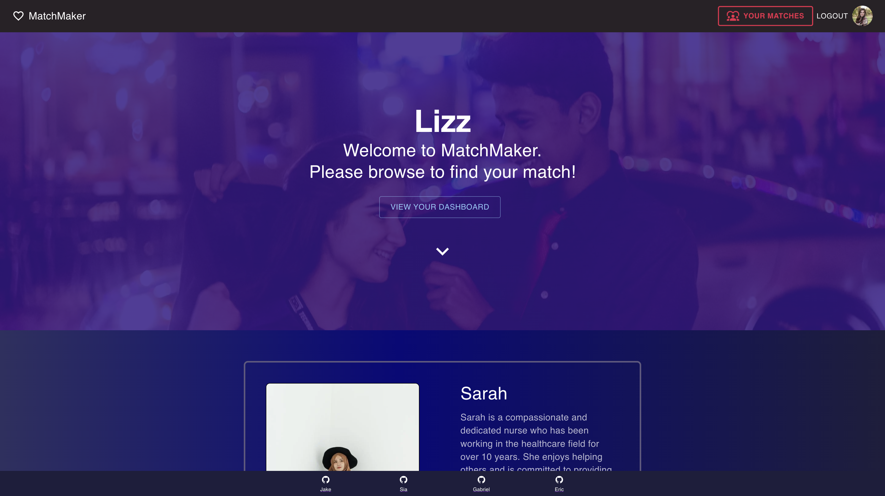
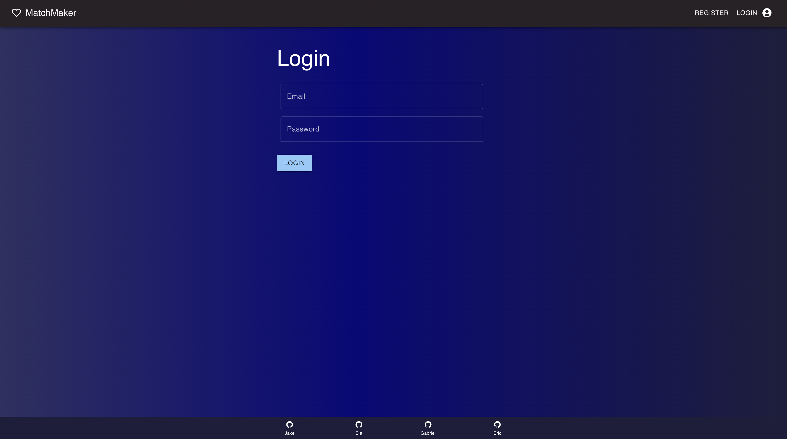
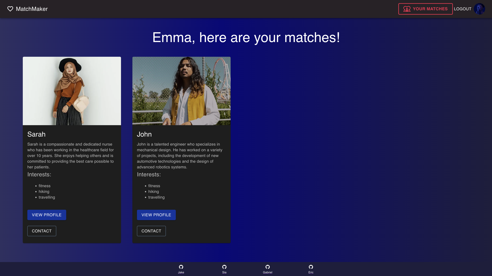
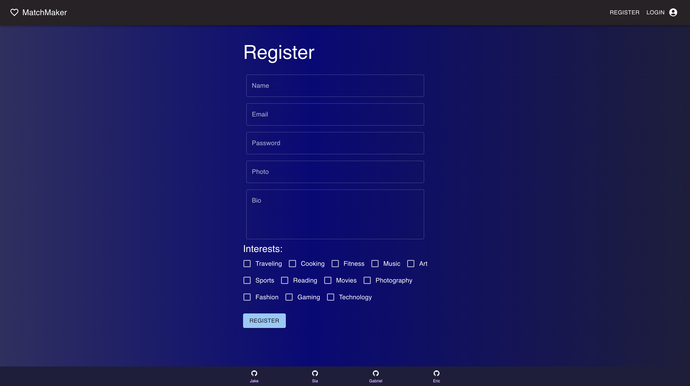
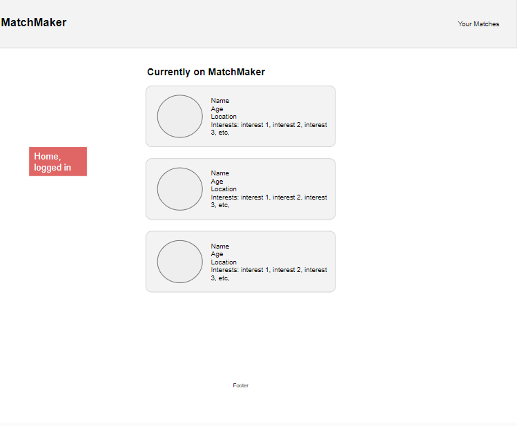

# MatchMaker

## _Table Of Contents_

1. [Description](#description)
2. [Technologies](#technologies)
3. [Repo Link](#repository-link)
4. [Deployed Application](#deployed-application)
5. [Screen Shots](#screen-shots)
6. [Contributors](#contributors)

## Description

This Dating App is a comprehensive online dating platform that allows users to find their perfect match.Our dating app is a modern, user-friendly platform designed to help singles find love and connect with like-minded individuals.The app suggest potential matches based on user prefernces and inetersts whether you're looking for a serious relationship or just some casual fun, our dating app is the perfect place to start your search.

## Technologies

We have utilized cutting-edge technologies such as React, GraphQL with Node.js, and Express.js server to ensure that the app is fast, efficient, and responsive. Our database is powered by MongoDB and Moongoose ODM, which allows for seamless integration with our front-end technologies. Additionally, we have implemented Material UI, a popular user interface library, to ensure that the app is visually appealing and easy to navigate.

## Repository-Link

[Github](https://github.com/JakeDish/date-app)

## Deployed-Application

[Deployed Application](https://matchmakerdating.herokuapp.com/)

## Screen-Shots

<!--  -->

## Contributors 

[Jake](https://github.com/JakeDish)
[Sia](https://github.com/siahmoymajid)
[Gabriel](https://github.com/Sm3gma)
[Eric](https://github.com/ericnguyen23)

